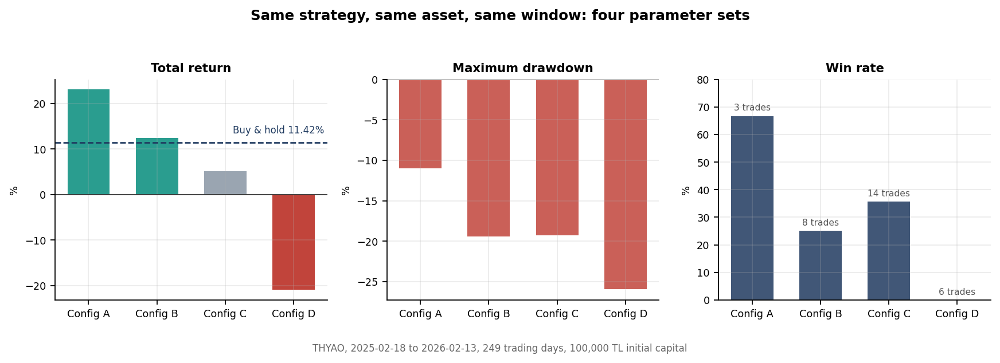

## Results

All figures below come from the reporting module in this repository. They are backtests on
Borsa Istanbul equities with commission and slippage applied, not live trading results.

### Parameter sensitivity

The same trend-following logic on the same instrument over the same window, run with four
different parameter sets:

| Config | Return | Max drawdown | Win rate | Trades |
|---|---|---|---|---|
| A | +23.1% | -11.0% | 66.7% | 3 |
| B | +12.4% | -19.4% | 25.0% | 8 |
| C | +5.2% | -19.3% | 35.7% | 14 |
| D | -21.0% | -26.0% | 0.0% | 6 |

Buy and hold over the same period returned +11.4%.

This chart is the main reason the project exists. A single favourable run proves very little:
the spread between the best and worst configuration here is over 44 percentage points on
identical data. Any result worth reporting has to survive parameter variation, which is what
the walk-forward module is for.

Note also that config A produced its return from three trades. A high win rate on a small
sample is not evidence of an edge.

### Portfolio run

Fifteen instruments, trend-following logic, at most five concurrent positions:

Portfolio return was +191.0% against +44.2% for the BIST 100 over the same period, with a
maximum drawdown of -11.1%. Nine of the fifteen instruments were profitable and six were not,
which is the expected shape for a trend-following approach: a minority of positions carries the
result while position sizing and stops limit the rest.

### Honest caveats

- Sharpe ratios in the single-instrument reports are computed against a Turkish lira risk-free rate, which has been high enough that strategies with strongly positive nominal returns still show negative excess return. The number is not comparable to a Sharpe ratio quoted in USD terms.
- The single-instrument and portfolio reports do not currently use identical risk-metric conventions. Reconciling them is on the roadmap.
- Sample sizes are small. Several runs above rest on fewer than ten trades.
- Backtest fills are simplified. Real execution on these instruments would differ.
